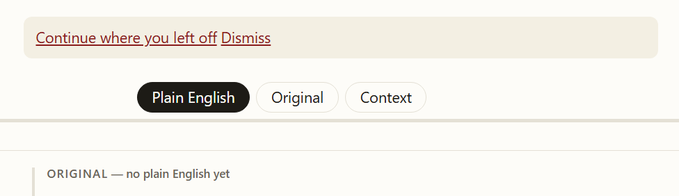

# Task 053 — Home library bookshelf: work cards, aggregated metrics, and scalable catalog UI

|                      |                                                                   |
| -------------------- | ----------------------------------------------------------------- |
| **Status**     | Done                                                              |
| **Filed**      | 2026-10-06                                                        |
| **Owner**      | Unassigned                                                        |
| **Severity**   | High (core UI/UX & scalability bottleneck for multi-work library) |
| **Milestone**  | M3 (archive growth & multi-author corpus)                         |
| **Depends on** | 031 (e-book reader experience), 040 (reading paths)               |
| **Related**    | 039 (major works), 041–052 (multi-work ingestion & rendering)    |

## Problem

The homepage currently flattens the library catalog by listing every single chapter for every work directly on `/`:

1. **Cognitive Overload & Clutter:** With multiple works in the archive (*Communist Manifesto*, *Theses on Feuerbach*, *Principles of Communism*, *Socialism: Utopian and Scientific*, *Wage Labour and Capital*, *Value, Price and Profit*, *1859 Preface*, and eventually *Das Kapital* with 33 chapters), listing every chapter inline creates an unreadable, endless directory dump.
2. **Duplication with Work Pages:** Each work already has a dedicated `WorkPage` (`/archive/{author}/works/{year}/{slug}/`) designed specifically for chapter navigation, per-chapter reading times, local progress tracking, and chapter status.
3. **Fragmented Completion Metrics:** Showing "X of Y passages in plain English" per chapter obscures the big picture: readers want to know at a glance whether the entire work is ready to read, how long it takes to read, and how many parts it contains.

## Goal

Redesign the homepage library section into a clean, scalable **Bookshelf / Work Card grid** (Option A):

- Present each work as a distinct, curated card with high-level metadata and aggregated metrics.
- Keep the homepage uncluttered as the archive grows to dozens of works and hundreds of chapters.
- Retain quick access to chapters via an optional collapsed preview accordion (`
`).

## Scope & Implementation Details

### 1. Work Card Architecture (`apps/web/src/app/page.tsx`)

Replace the flat `ul.library > li > ul` with a modern card grid:

- **Header & Attribution:**
  - Work title linking to the work page (`workPath(work)`).
  - Authors and original year (e.g. "Karl Marx and Frederick Engels, 1848").
  - Translator attribution if applicable.
- **Aggregated Reading Metrics:**
  - Total chapters: `X chapters` (or `Single essay / preface`).
  - Total reading time: Estimated total minutes across all chapters at standard reading speed (e.g. `~45 min read`).
  - Plain English status badge:
    - `Complete (all chapters)` if 100% of chapters have complete Plain English.
    - `In progress (N/M chapters ready)` if partially translated.
    - `Original only` if pending Plain English rendering.
- **Actions:**
  - Primary "Start reading" / "Read work" link pointing to the first chapter or work page.
  - Secondary "Table of contents" link to the dedicated work page.
- **Compact Chapter Preview:**
  - Collapsible `
` with `
Preview chapters (N) ▾
` so readers can inspect the chapter list inline without disrupting the overall page flow.

### 2. Styling & Aesthetics (`apps/web/src/app/globals.css`)

- Introduce `.library-grid`, `.work-card`, `.work-card-header`, `.work-card-meta`, `.work-card-status`, `.work-card-actions`, and `.work-chapters-preview`.
- Support responsive layout: clean 1-column stack on mobile, 2-column or balanced grid on wider viewports.
- Maintain consistency with light, sepia, dark, and black themes.

### 3. Testing & Invariants

- Preserve existing `a.start-reading` invariant checked by `e2e/ux.spec.ts`.
- Ensure axe accessibility standards pass for all themes.

## Acceptance Criteria

- [X] Homepage `/` displays works as curated Work Cards instead of an uncollapsed list of all chapters.
- [X] Each card shows aggregated metadata: chapter count, total estimated reading time, and Plain English status.
- [X] Chapter list is tucked inside a clean, collapsed `
` preview per card.
- [X] Works link seamlessly to their dedicated `WorkPage` and first chapter.
- [X] Responsive across mobile and desktop.
- [X] `pnpm check` and `pnpm e2e` pass 100%.
- [X] Streamlined WorkCard action buttons (eliminated duplicate "Table of contents" link).
- [X] Reading path steps formatted with structured multi-row hierarchy instead of single-line cramming.
- [X] Reader Layer Switch auto-detects layer availability: defaults to Original when Plain English is missing, and disables unavailable layers with blur-no-click styling.

## Follow-up Refinements & Issue Resolutions

### 1. WorkCard Redundancy Clean-up

- **Issue:** The work title and the "Table of contents" CTA both navigated to the exact same URL (`workPath(work)`).
- **Resolution:** Removed the redundant secondary link, keeping the primary `Read work →` CTA (or `Read text →` for single essay / preface) and allowing title click / chapter preview for TOC navigation.

### 2. Reading Paths Step Layout Polish (`/paths/[id]/`)

- **Issue:** In `/paths/marxism-fundamentals/`, chapter title, work attribution, reading time, and checkbox were jammed onto a single horizontal line separated by dots (`·`), creating wrapped, cluttered rows.
- **Resolution:** Restructured `PathSteps.tsx` into a 2-tier hierarchy:
  - Top row: prominent chapter/step link.
  - Sub-row: source work name (when different from chapter) and estimated read time.
  - Right-aligned: pill-styled `Read` checkbox button with smooth hover feedback.

### 3. Layer Switch Availability & Fallback for Untranslated Works

- **Issue:** When viewing works without Plain English (e.g. *Theses on Feuerbach*, *Principles of Communism*, *Value, Price and Profit*) or without Context explanations, the reader still defaulted to "Plain English" as the active selected layer, showing `ORIGINAL — no plain English yet` fallback notices while locking the toggle button.

- **Resolution:**
  - `apps/web/src/app/archive/[...path]/page.tsx`: Computes layer availability (`hasPlain`, `hasOriginal`, `hasContext`) and passes it to `LayerSwitch`. Untranslated documents execute an immediate pre-hydration script setting `data-layers="original"` to eliminate flash of fallback notices.
  - `apps/web/src/components/LayerSwitch.tsx`: When `plain` is unavailable, defaults to `original`. Buttons for unavailable layers are marked `data-unavailable="true"` and `disabled`.
  - `apps/web/src/app/globals.css`: Styled unavailable buttons with `blur-no-click` (`opacity: 0.35; filter: blur(0.25px); cursor: not-allowed; pointer-events: none`).

## Verification & Deployment Evidence

- **Unit & Schema Tests:** `pnpm check` passed cleanly (423/423 tests across 32 test files).
- **End-to-End Tests:** `pnpm e2e` passed 153/153 Playwright tests across desktop and mobile.
- **Commits:**
  - `a07ffe0`: `feat(web): implement task 053 home library bookshelf UI`
  - `0fa79fd`: `fix(web): streamline work card actions and polish reading paths layout`
  - Subsequent commit: `fix(web): handle layer availability and disable missing layers with blur-no-click`
- **Cloudflare Pages Production Deployment:** Verified live on Cloudflare Pages.
